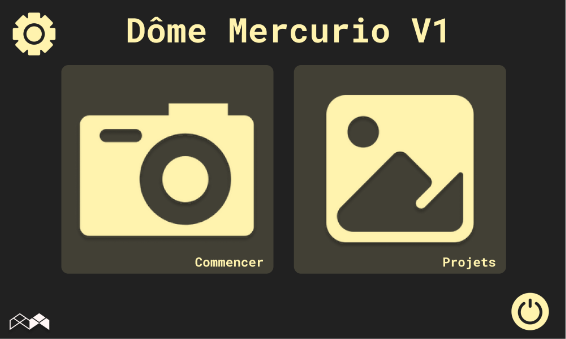
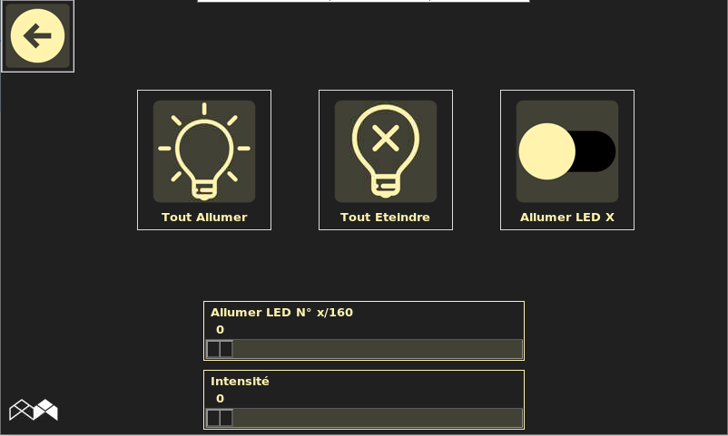
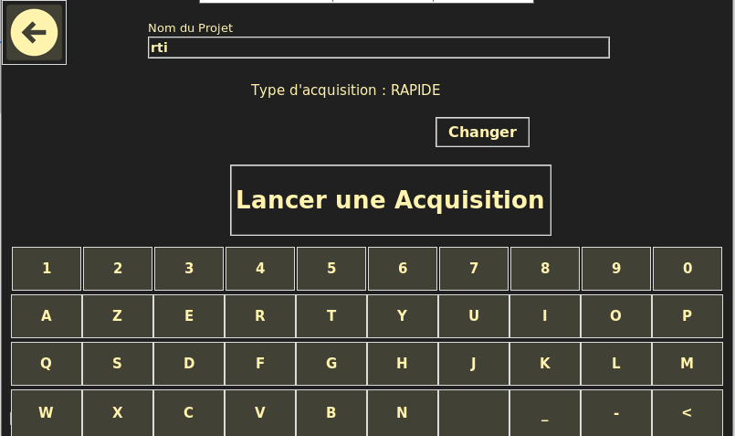

# DATA ACQUISITION DOME VERSION 0
 *GUI for data acquisition from dome, this allows users to control images captures and lights (LEDs)*

<div style="text-align: center">

</div>

## Table of Contents
1. [Installation and Usage](#installation-and-usage)
2. [Data Format](#data-format)
3. [Hardware Description](#hardware-description)
4. [Short Tutorial](#short-tutorial)


## Installation and Usage

### Install

Install requirements Python packages, It requires **Python 3.7** or any later version.

```
pip install -r requirements.txt
```
To update packages:

```
sudo apt-get install build-essential python-all-dev libexiv2-dev libboost-python-dev
pip3 install py3exiv2
sudo apt-get install python3-pil python3-pil.imagetk
sudo apt install gphoto2
```
### ARDUINO 

Install Arduino :

```
sudo apt-get install arduino
```

Inside Arduino IDE, import **microdome** package

- Use Serial communication library : <Wire.h> 

### Usage

- *gphoto2* main command to control camera from Raspberry Pi
- *Settings* to edit parameters such Actor's data, Environment and Folders, it allows also to test camera and dome
- *View* projects* Shows previous projects
- *Start* to start acquisition from : grandDome, micro dome

## Data Format
 
- *JPG* Images captured from camera
- *Json* contains data saved from dome Settings 
- *lb* Shows lights coordinates

## Hardware Description 

- *RTC* Real Time Clock 
- *Arduino Pro Mini* as slave 
- *Raspberry Pi4* as Master

* to program Arduino : 

- From Arduino IDE, generate binary files (.hex)
- In Respberry Terminal, execute:
```
sudo apt-get install avrdude
```
- Compile avrdude
```
sudo apt-get update
sudo apt-get install -y build-essential bison flex automake libelf-dev libusb-1.0-0-dev libusb-dev libftdi-dev libftdi1
```
- Download the source and configure avrdude for compilation by executing:
```
wget http://download.savannah.gnu.org/releases/avrdude/avrdude-6.1.tar.gz
tar xvfz avrdude-6.1.tar.gz
cd avrdude-6.1
./configure --enable-linuxgpio
```

- Now build and install avrdude by running:
```
make
sudo make install
```

- Configuration
```
cp /etc/avrdude.conf ~/avrdude_gpio.conf
nano ~/avrdude_gpio.conf
```
- Once in the editor scroll all the way down to the very **end** of the file.  You'll need to add a new section that configures the GPIO pin programming.  Paste in the following section at the end of the file:
```
# Linux GPIO configuration for avrdude.
# Change the lines below to the GPIO pins connected to the AVR.
programmer
  id    = "pi_1";
  desc  = "Use the Linux sysfs interface to bitbang GPIO lines";
  type  = "linuxgpio";
  reset = 6;
  sck   = 11;
  mosi  = 10;
  miso  = 9;
;
```

- Programming: goto binary files generated with Arduino and replace file name in <>:
```
sudo avrdude -p atmega328p -C ~/avrdude_gpio.conf -c pi_1 -v -U flash:w:<file>.hex:i
```

## Short Tutorial

### Test Dome
* Go to **Settings** -> **Test Dome** 
<div style="text-align: center">

</div>

### Test Camera
* Go to **Settings** -> **Test Camera** 

### Start Acquisition
* Go to **Start** -> **Give name to the project**  -> **Chose your option** 
<div style="text-align: center">

</div>


### DATA ACQUISITION 
```
pip install -r requirements.txt
sudo apt-get install build-essential python-all-dev libexiv2-dev libboost-python-dev
pip3 install py3exiv2
sudo apt-get install python3-pil python3-pil.imagetk
sudo apt install gphoto2
```
### ARDUINO Nano
- Serial communication library : <Wire.h> 
- To set RTC 1307 : 
```
https://fuzzthepiguy.tech/rtc/
```

### RASPBERRY 
Please install requirements into Raspberry GUI
